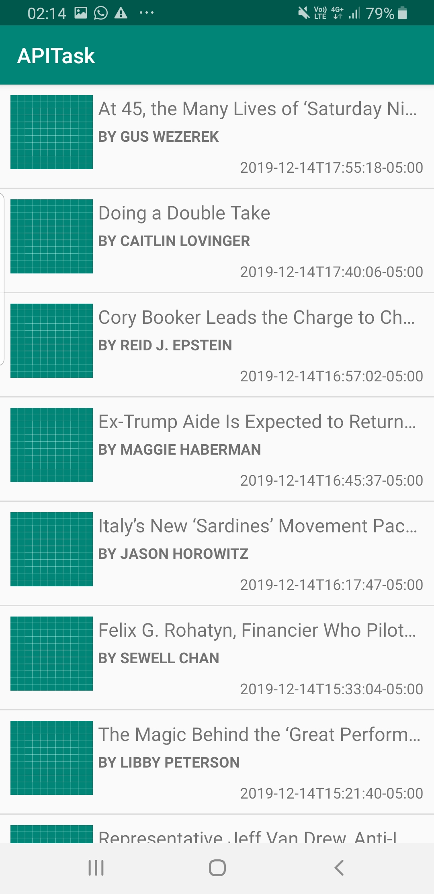
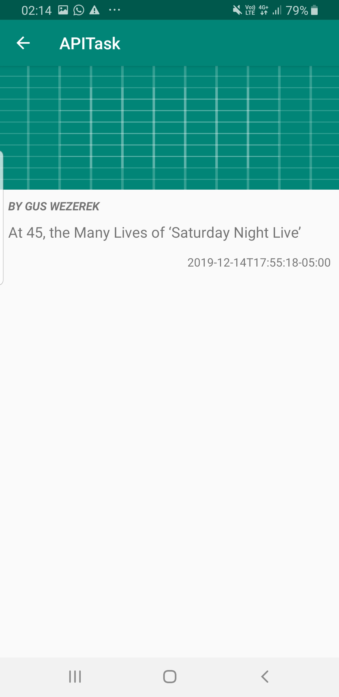

# Project  - *NY Times API*

**APITask** is an android app that allows a user to  to hit the NY Times Times Newswire API and show a list of articles, that
shows details when items on the list are tapped. The app utilizes [New York Times API](https://developer.nytimes.com/apis).

## Required Functionality

Following **requirements** have been met:

* [x] Object Oriented Programming approach
* [x] Good Architectural Pattern: MVVM
* [x] Generic, Simple Reusable code
* [x] Code written following Android Coding Standards
* [x] Android Lint for static code analysis
* [x] Instructions on how to import and run the code

## Instructions
### Prerequisites
* [Gradle Build Tool](https://gradle.org/).
* Latest release of the [Java JDK version 8](https://www.oracle.com/technetwork/java/javase/downloads/jdk8-downloads-2133151.html).
* [Git client](https://git-scm.com/downloads).
* [Android Studio](https://developer.android.com/studio/) version 3.1 or later.
* [Android SDK](https://developer.android.com/studio/index.html#downloads) with the API level 26 or later.
### Import to Android Studio

1. Clone this repository into a local directory on your machine.
2. Open Android Studio and select the "Import project" menu item in the welcome screen. 
3. Navigate to the location where you cloned the repository in your computer, and select the repository folder.
4. Android Studio should be able to import the project automatically.
5. Build and install the app by using either the Run tool or by using the following command in the terminal
```
gradlew installDebug
```

## Screenshots

<b>Main article list Screen</b>


<b>Details View Screen</b>

